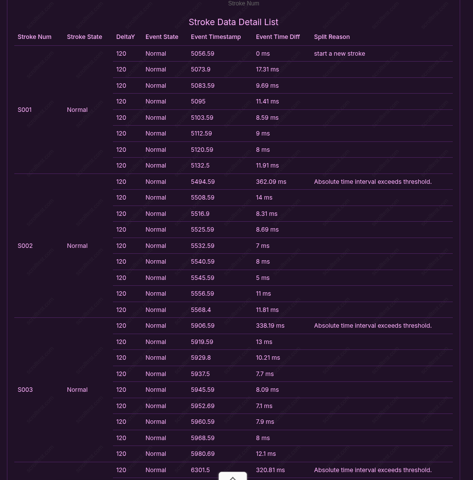

+++
date = '2026-04-03T22:29:40-04:00'
draft = false
title = 'First Rant'
summary = 'I want to rant about Keychron M6. Fucking bitch with 20ms scroll wheel latency.'
type = 'post'
+++

I want to rant about Keychron M6.

Fucking bitch with 20ms scroll wheel latency.

## How It Started

G502 fucking sucks. Heavy as shit. "Ergonomic shape". Rubber side. Dead skin accumulator. Believed me when I say I had it for 4 years until I threw it to the trash.

Endgame Gear XM1r has fucking shit quality assurance. My scroll wheel got fucked. Sent to fix. Guess what I got? The same broken mess.

Viper 8KHz. What can I say. Anyone making this should just be retroactively aborted. Flimsiest shit I have ever held in my hand. And worst of all, rubber side.

DeathAdder V3. Very decent mouse. I love it. Attempted doing surgery on it. It died on me. Rest in Peace.

The year was then 2024. It d been 6 years since I first bought G502. Around that time, I discovered Chinese clones.

Dragonfly VXE R1 Max. Pink. Good. Wireless. Top specs. $40. This is why China can't stop winning (my money).

The year is now 2026. I am bored. I want to get new mouse. I want to get ergonomic mouse.

Bought G502X. Worse than what I remember about G502. The mouse is smaller, has less thumb space and length, and it just looks fucking goofy. Returned on the same day it arrived.

## We Are Here

So, after a few years of using light weight gaming mouse, I now just want an ergonomic mouse. A light weight ergonomic mouse. A G502 that does not SUCK.

The first contender is mchose G7 because China. Everything about it is just perfect except for the fact that the MAX variant is never available.

I want to continue ranting about mice here but Imma stop myself for a minute and dedicate this paragraph to the Chinese vendors at AliExpress for selling everything.

Anyway, I remember seeing a few of mchose model on LTT so I guess they have entered the mainstream space. And if there is anything you know about AliExpress vendors, they will raise prices like hell if the opportunity arises. 8Bitdo, GuiliKit, BigMe, you name them. I hope no one will ever review ZENOTTIC glasses because I am enjoying $50 for a frame a lot, thank you very much.

I have no reasons to look at the Western market just because of brands like Razer or Logitech. The cost is simply absurd for something I can get at 95% of quality at 30% of the price.

Enter Keychron. They arte technically still China but they are well-known globally. \$70 for: THE top specs, wireless, G502 shape, no rubber, and driver that works on Linux? \$70 for everything that I see on their site. There is no tiered price for different models. They all are \$70. What? Sold. Keychron M6. I want you.

## Waste of Time

The first M6 order arrived on March 12. It felt nice. Not something I was used to yet. But I was willing to learn this shape. The extra buttons and scroll wheel were totally worth it. I played a few Dota matches. It was good. I booted up KZ. I had been played for a fool. Someone, somebody, in 2026, decided to implement locked latency to the scroll wheel at 20ms.

\

Well, I might have had a defective unit. Or maybe I just did not get upsold to their best model. Alright, I ordered 8K model.

It is still locked.

Are you telling me, G502, released in 2026, does not have this artificial limit. But this new mouse in 2026, needs its little lock, to protect the encoder from being fried or whatever? At the very least it still feels better than G502. The only way for G502 to be better than M6 is to have a dedicated suck-my-dick button.

\

We are afraid that you found out we spray our product with shit and we can't do anything about it (what are you gonna do about it you little bitch?)

## The Lesson

Get M7 model instead. Has none of the down side. It is a proper gaming mouse. Still got my hand cramped like a bitch...

