+++
date = '2026-04-17T10:33:57-04:00'
draft = false
title = '(Do not) Buy Super Flower Power Supply'
author = 'hello'
summary = "Buy it because it is cheap. Don't buy it because it is cheap."
type = 'post'
+++

Around late November, Gamers Nexus released this video.


I had been itching to upgrade my... second hand... AMD 6700XT bought in... 2024... and I trusted the call in video so I got... second hand... AMD 9070 XT for $550. Facebook Marketplace is a wonderful place. After driving for 60 minutes under cold weather, I met the seller in a CarMax parking lot. We exchanged some small talk. I mentioned the video to him how the prices were only low then and things would never recover. Remembering it again, I felt like he had some regrets selling the GPU too early. But you know what they say, the early bird gets the worm, or whatever.

```plaintext
GIGABYTE Radeon RX 9070 XT Gaming OC 16G Graphics Card, PCIe 5.0, 16GB GDDR6, GV-R9070XTGAMING OC-16GD Video Card 
```

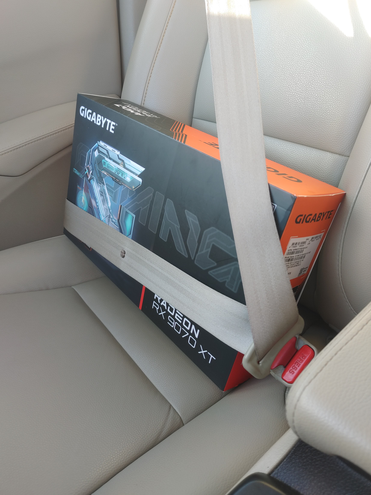

What does this have anything to do with Super Flower power supply you ask?

## Buying New Power Supply

My new GPU was meant to replace my older GPU. I never planned to use them both at the same time. The biggest factor pushing me to buying new power supply is being able to play Dota 2 on my new GPU.

I play a lot of Dota 2. For some reason, every 2 minutes or so during a match, my framerate drops to 60-70 from consistent 144. I checked the GPU power draw. I was very impressed by its efficiency. But, the GPU just straight up refused to draw more than 40W during peak teamfight. The problem was surely then something had to do with power draw. But I was so blinded that I thought it is the PSU that refused to give the GPU more power (even though I played CP2077 at max settings, drawing 300W).

So then, I browsed around some forums, found out that **Hardware Busters** is go-to site for power supply review. After reading through the content, convinced by the charts, I simply bought the best reviewed 1000W-1250W PSU on the site: **Super Flower Leadex VII XP 1200W**

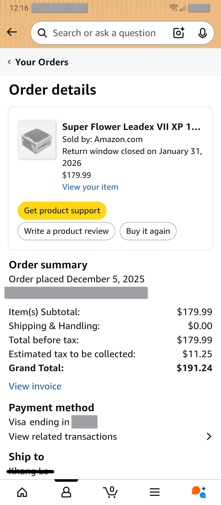

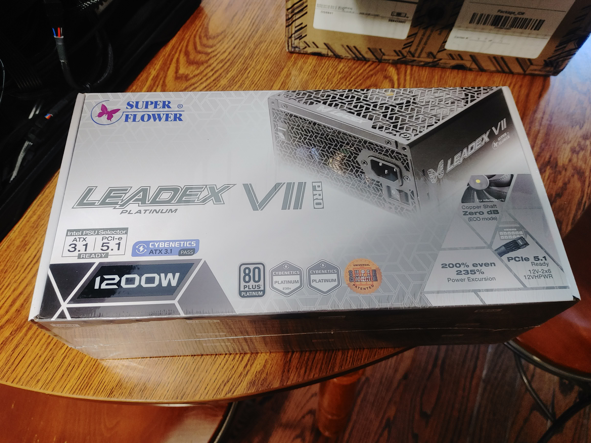

I put the power supply inside my computer.

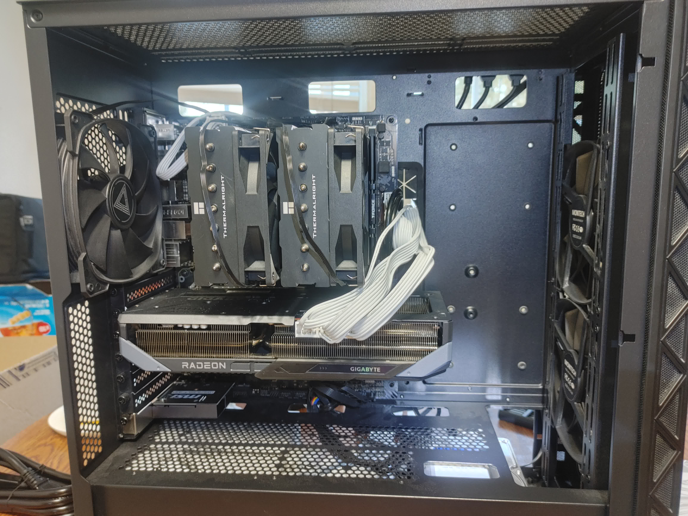
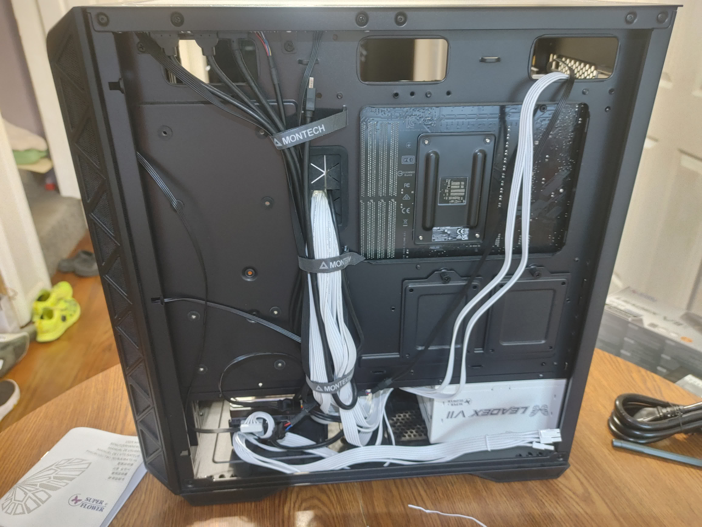

Well, the power supply worked. I played Dota 2 for a few matches. I am not sure if this is foreshadowed or not but of course that did not fix the problem. Why would I be able to play E33 and CP2077 at max settings, have the GPU drawing 300W, and be unable to force Dota 2 to draw more than 50W?

Of course the problem is with the GPU.

This is what it looks like.

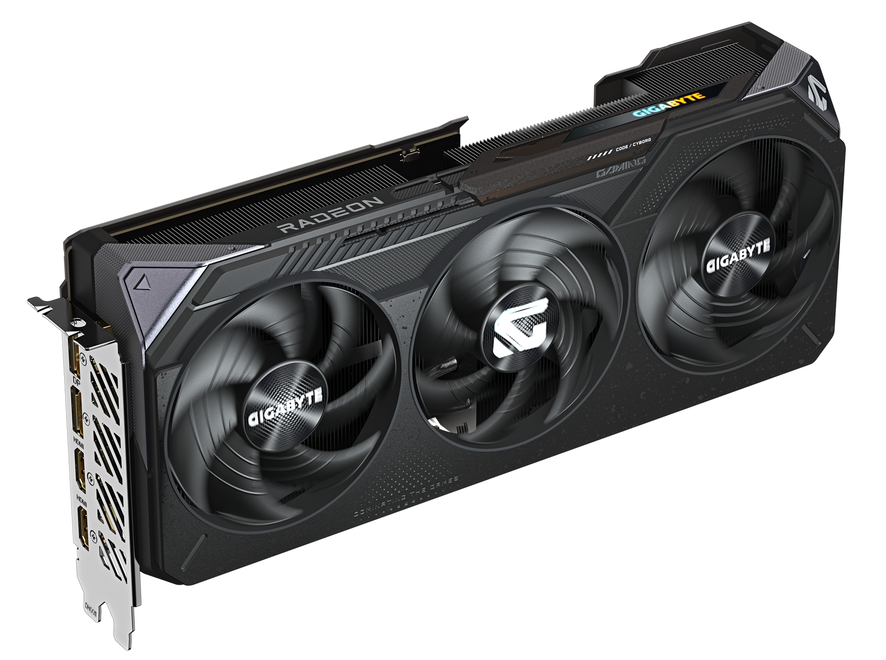

Do you see the problem?

.

.

.

.

.

.

.

.

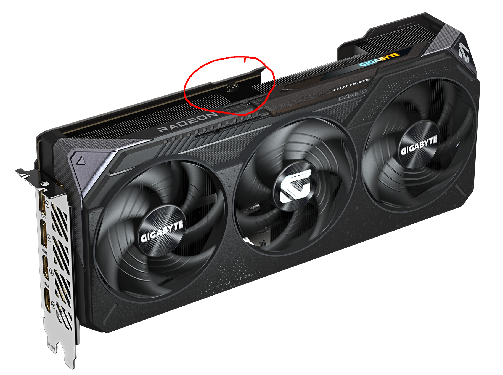

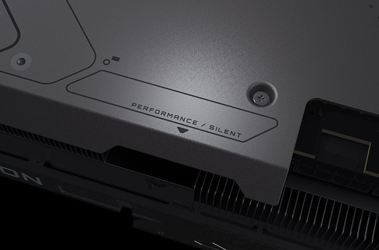

This GPU has badly implemented dual BIOS power curve. And the whole time, I was on the quiet BIOS. With a flick of a switch, Dota 2 was finally able to draw a whooping 50W on max settings.

Now, the clown is me. I am left to hold the bag. I have an overspec'd PSU. I spent time replacing it with old one. I don't want to take out this new power supply. The only way to remedy the situation is just to install 2 GPUs. I will be running with 9070XT and 6700XT. Well, it makes a lot of sense at that time to hold on to my 6700XT. Financially, I got this GPU for $180 a year prior so I should be able to profit at least $20 off Facebook Marketplace. Technologically, 6700XT has 12GB of VRAM. With 9070XT, I should be able to run a 32B model at 8-bit precision. Overall, more reasons to keep it than to sell it away from my point of view. I wanted, really wanted, to keep my old GPU.

And then, it came to me, the box came with 4 VGA cables. There is no daisy-chain. I really need 5 cables to drive both GPUs.

### What is a VGA Cable?

Well, it is just a VGA cable. I could just take it from my older power supply because I did not have any use for it.

WRONG. Super Flower Leadex VII uses proprietary "Universal" cable with 9 terminals at the power supply. This is not mentioned anywhere on HWBuster review of the power supply.

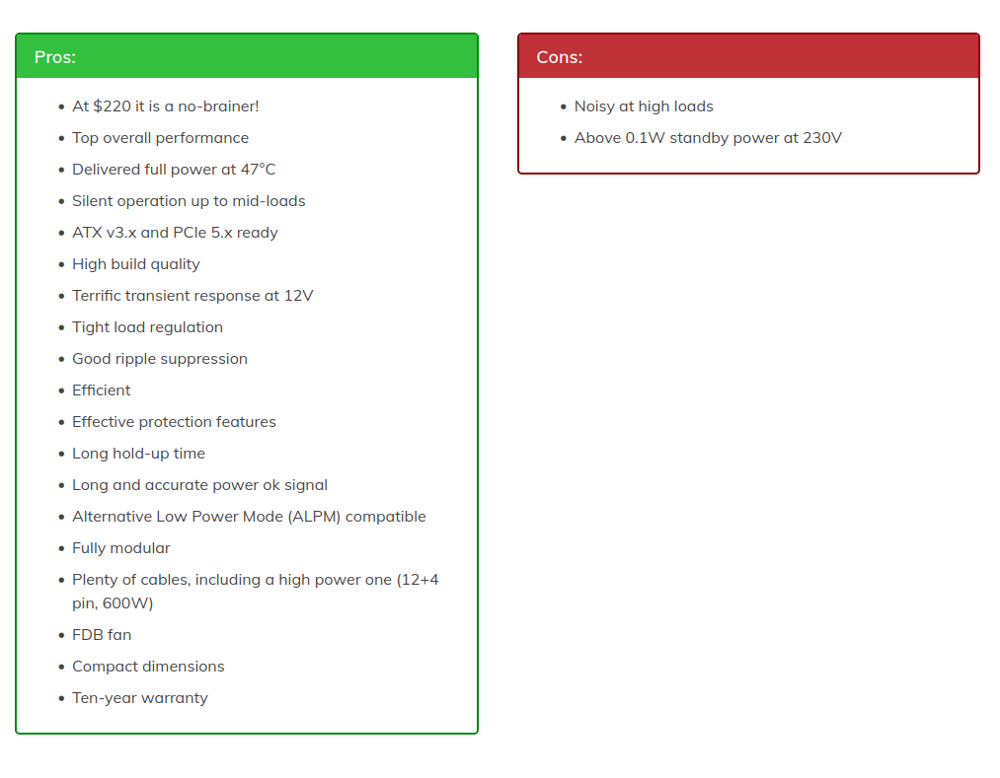

Your typical PSU cable hole should look like 2 rows of terminals. This is standardized. Super Flower Universal connector goes with 3 rows.

Funny enough, the images from the review seems to be wrong as well. I think they were posting image of the ***XG*** version, not the ***XP*** that I have or what the website claimed to review.

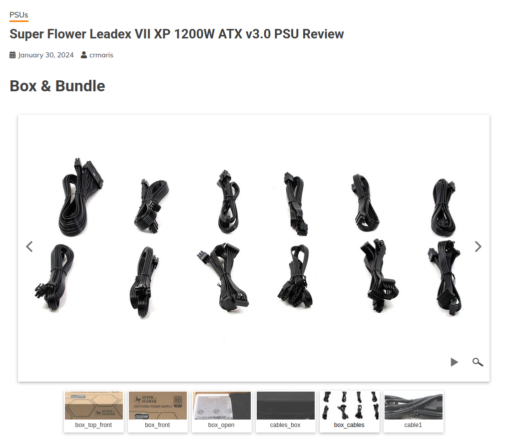

Alright then, I got the power supply off Amazon, I should be able to get it off Amazon then.

WRONG. This """PATENTED""" connector is not available on any storefront. Super Flower does have 12VHPWR available but that is not what I need. It is not even the right cable because it is not """Universal""" connector. And even then, the cable is not even available in stock to get.

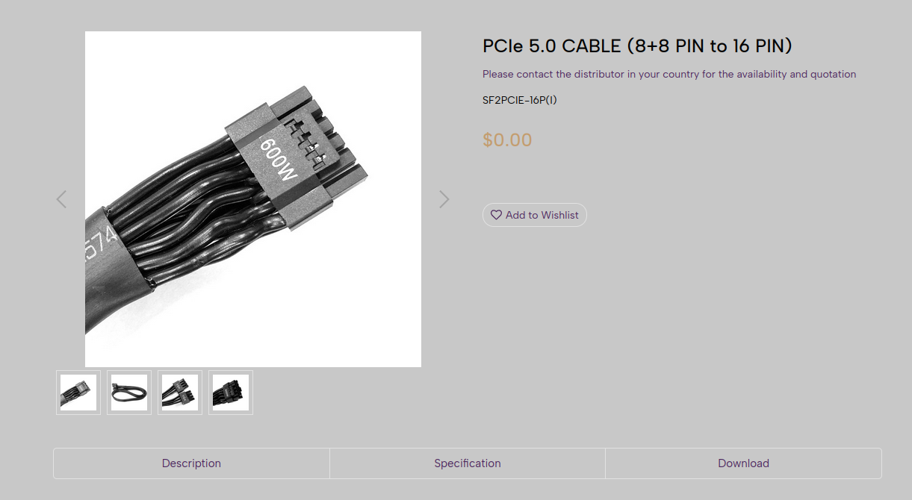

There are lots of discourse online about Super Flower cable but none of them tell me where to get the cable. So, just like any other sane persons, I turned to AliExpress for third party cable. And of course, they don't have it. At that point, I was very desperate, I would just buy anything that resembles a 3x3 connector. Then, I bought this.

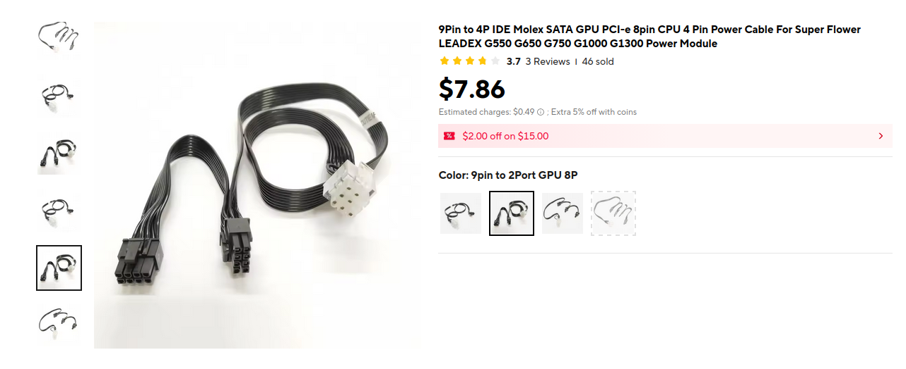

If you don't realize the main theme of the story so far, yes, the cable does not work.

So, I just, like, gave up.

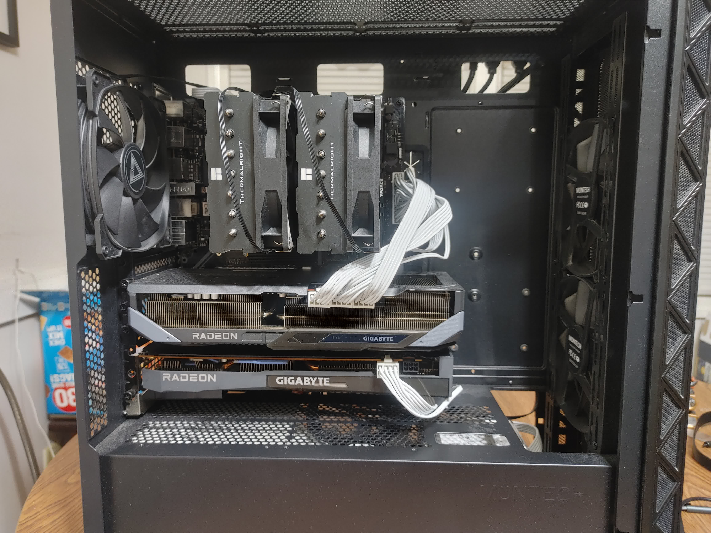

### Months of Being Cableless

Until last week or so, I emailed Super Flower out of the blue for cable.

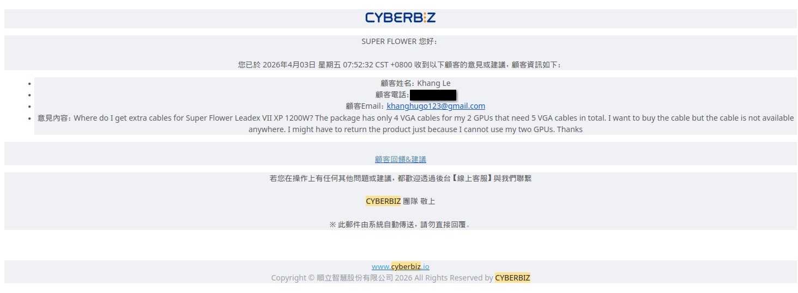

They responded. The cable is $9 per piece, regardless of type, and $15 shipping.

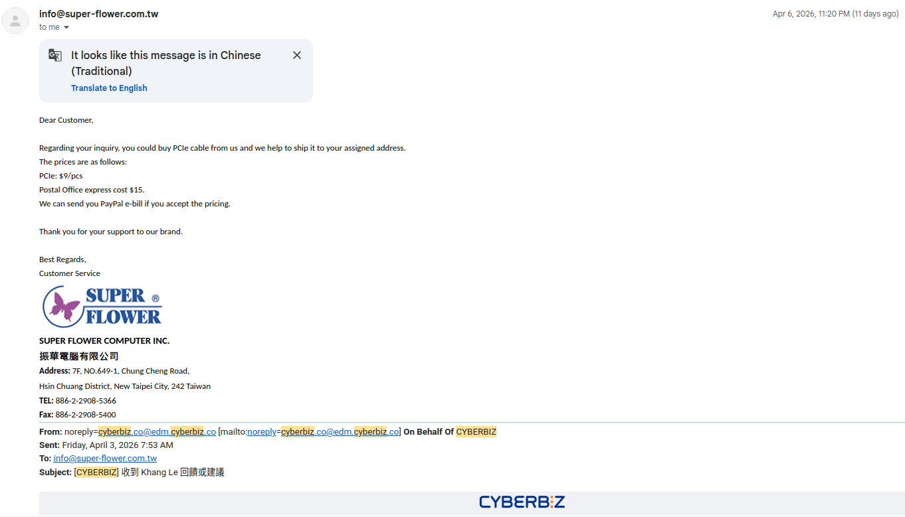

You know how this ends. I said yes and sent them the money. I will be expecting the cable in a few days. And yes, I did try haggling and they are very firm on the pricing.

### What Do We Learn?

If you plan to run dual GPU setup and you want to get Super Flower Leadex VII ***XP*** power supply, consider whether going through support channel and paying extra just to get cable is worth it.

In total, I paid $191 + $33 = $224 for my power supply. This is with tax. "Raw" price wise, it should run you $180 + $19 = $200. It is still cheap if I compared with the best of the best from other brands like be quiet! or ASUS or Seasonic. But, would that price difference pay off the headache of getting the cable? For me, no. I like buying good cheap goods. At the time of writing this, I found out that there are PSUs with the same specs (1200W, Platinum) sold at $130. Not sure how that works.

On the PSU review side, I think there is a good reason to stick with things that are expensive for a reason. Reviewers, and hence reviews, can be blindsided by the raw numbers and charts. There are more than the performance of a product. How is the product support? What are warranty policies? How easy is it to repair? Why are the cables not available on any storefronts? Reviewers can only give you one side of the story. And for the rest, you must inform yourself. Don't get information from one source just like I did. Look up the model, add the word "bad", "shit", or whatever to the search query to find out why people hate a certain product. And hey, maybe then you can stumble on this post, perchance.

### The Verdict

* Performance: 10/10 (best of the best according to review)
* Value: 8/10 ($180 at the time plus $30 just for cables)
* Sanity: 2/10 (I have a non-functional cable from AliExpress)
* Dota 2: stuttered for whole 1 week
* Bush: did 9/11

### Unrelated

Fuck USB header for being fragile piece of shit. The housing literally slipped off and I bent my pins when attempting to plug the header.

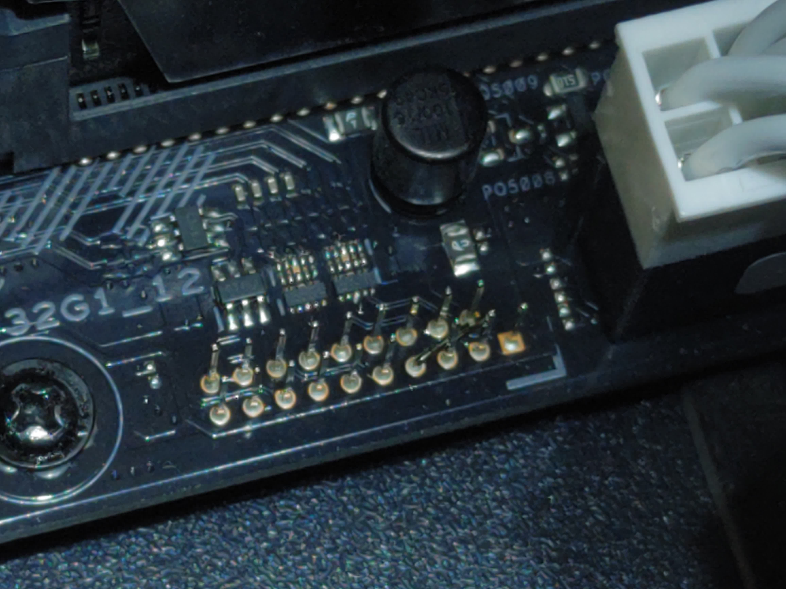
