+++
date = '2026-05-10T14:18:06-04:00'
draft = false
title = 'BLBH and How Model Baking Works in GoldSrc'
author = 'hello'
type = 'post'
+++

BLBH is part of [gchimp](https://github.com/khanghugo/gchimp) tool.

BLBH stands for "Blender lightmap baker helper". It is a GoldSrc mapping tools. What it actually does is to split any* arbitrary atlas image to smaller textures of size 512x512.

<!--more-->

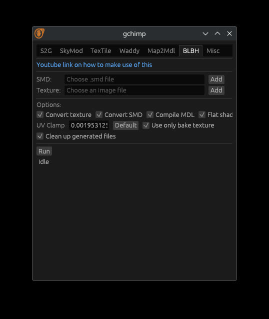

## Making of arte_drift

A little bit of *detour* but bear with me here.

Around late 2024, I wanted to make an actual KZ map. As opposed to "actual" maps, my non-actual maps were a wide range of repertoires including meme KZ maps and a bunch of Source surf map ports. [arte_tokazys](https://www.youtube.com/watch?v=ZbTxC4Xrvx4) and [arte_twist](https://www.youtube.com/watch?v=UVlmsk_wH7g) were released around that time and I am sure you know what they are. My surf port includes [surf_cyberwave](https://gamebanana.com/mods/554004), [surf_utopia](https://gamebanana.com/mods/501258), and many more.

Whatever you want to say about my maps, they are very very very different and employs various technique and technology. I certainly had more technical chops than creativity and map design knowledge. So, it was only proper to build something new. Something people have never seen before, at the very least inside CS 1.6.

[surf_drifting](https://gamebanana.com/mods/137762) is the map that I copied for arte_drift, as you can't tell from the name (and reference inside the map).

Images from batman excellent showcase video [surf_drifting tas](https://www.youtube.com/watch?v=I4q-wHBW4no)

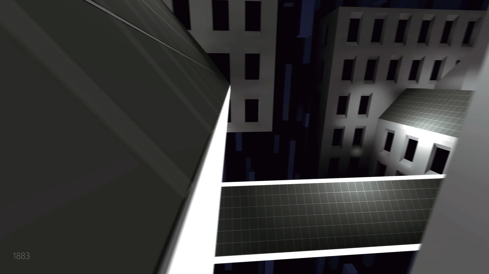

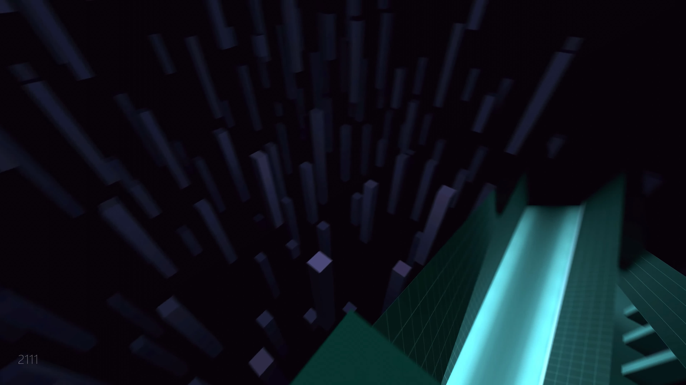

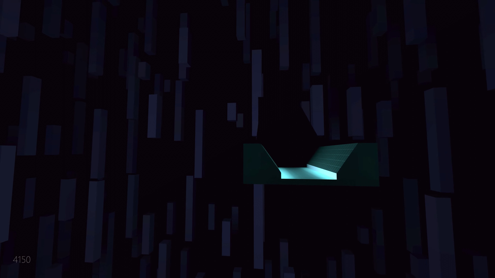

The theme is black-and-white building with, for what people call it, PS2-esque background.

Images from [pepi's WR](https://www.youtube.com/watch?v=7asA2DftsYY) run on arte_drift.

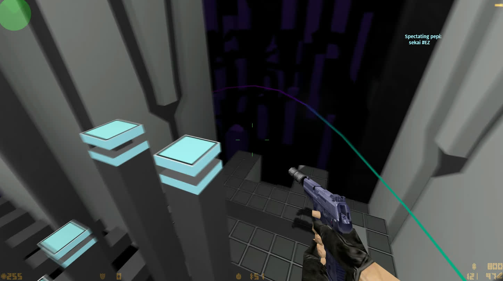

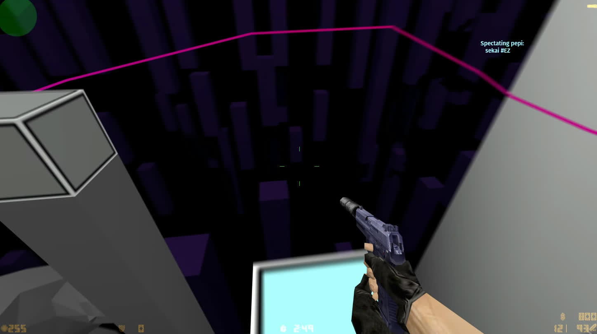

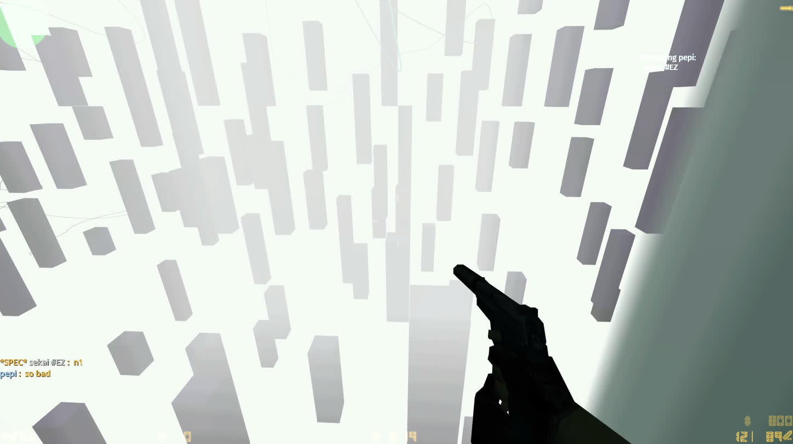

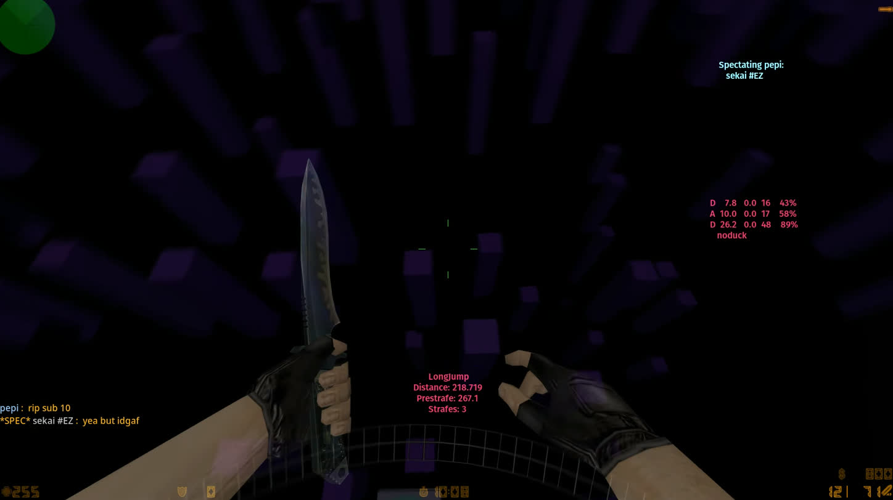

There are a few things I wanted to steal from the map: the infinite skybox, the fog, the abstract building, and the ramp design.

I did really try my best to imitate the original map but let's call the slight visual deviation my own spin rather than incomptency or the lack of effort.

And again? You see the background? Those flying rectangular prisms? Yes, they are real models, and they have baked lighting on top. I am talking about my map. Of course the tool to make such models did not exist at the time. Of course, I have to come up with a way and that is to make BLBH. I created BLBH just for this map, yes. And later I found out that BLBH has insane utility and simply becomes my own **most used** tool.

## Sidetracked a little bit by timeline

I don't even remember how I even came up with the idea.

This is the first BLBH commit.

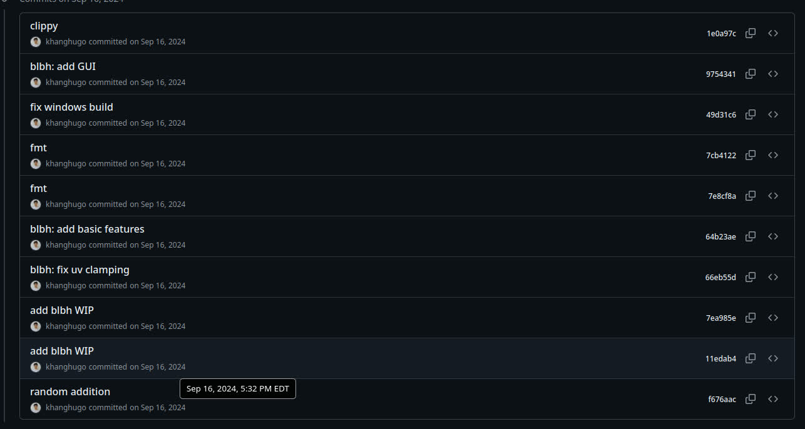

This is when arte_drift skybox was first made.

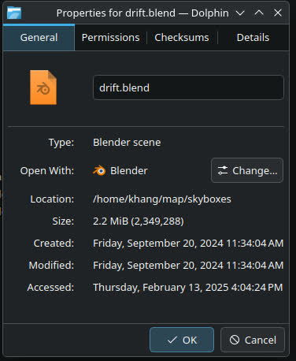

This is when arte_drift was first made.

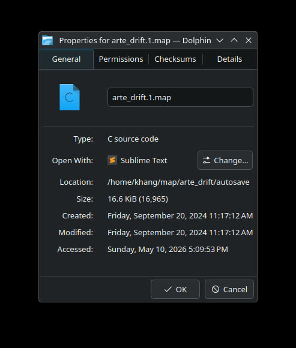

I dug up some messages from TWHL discord (message reacted by [seedee](https://github.com/seedee) btw).

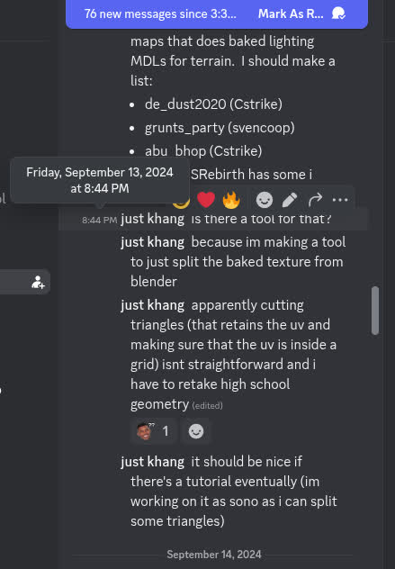

The first BLBH (WIP) model.

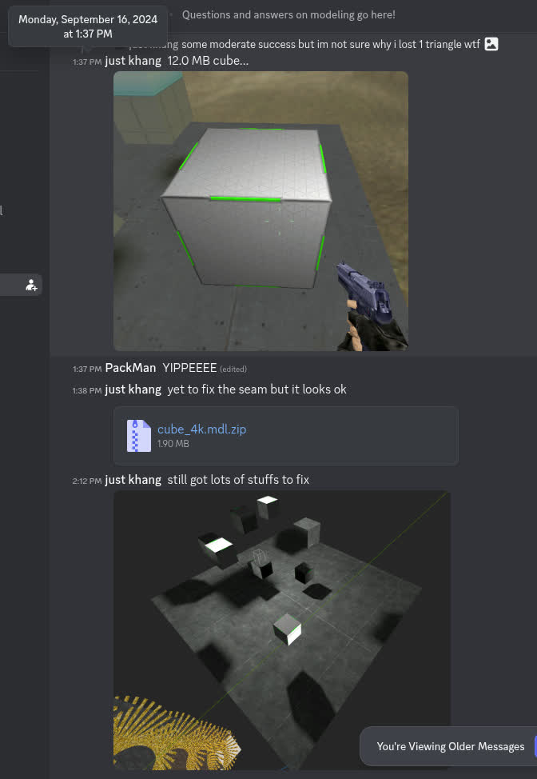

I also found my question regarding the math to make BLBH works in SourceRuns discord. Huge shoutout to **sphere0218** for basically carrying my math homework that I never have to do.

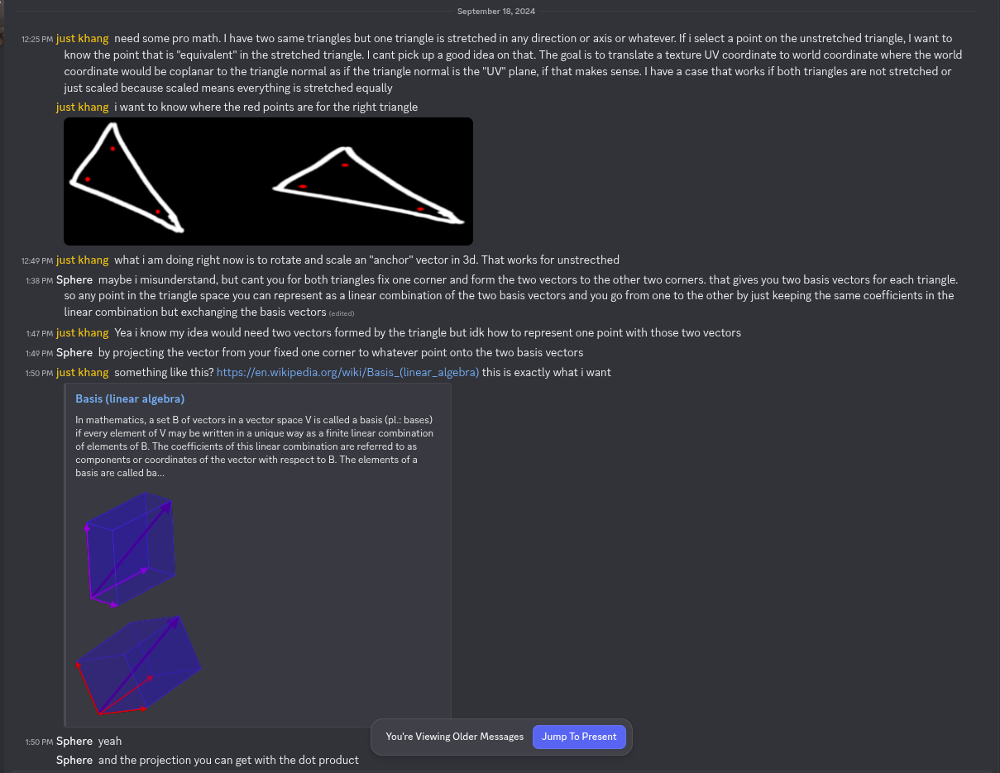

I am pretty confident to say BLBH was made in like 3 days. Maybe I'm the goat.

## Problems need solving

What is the goal again? Ahh, goal is to have model lighting in vanilla GoldSrc.

### Problem #1 -- Studio model in vanilla GoldSrc does not have per vertex lighting

Vertex lighting simply means each vertex are lit independently on some sampled points. For example, if a view model is half under sunlight, half under shade, you will see the model is half bright and half dimmed. It just makes sense. This is not the same for GoldSrc. Every vertex is sampled by one point, which is below where entity origin is.

How do I solve this? Of course I don't solve it. There is only work-around.

Like how a map has baked lighting processed in RAD step, let's have baked lighting for model.


### Problem #2 -- Baked light on model? How?

Use [Blender](https://www.blender.org/) or something similar.

Uwrap model UV to a 512x512 texture and bake light. Then export the model with [Blender Source Tools](http://steamreview.org/BlenderSourceTools/) along with the baked texture. Compile it with [SvenCoop's studiomdl](https://github.com/khanghugo/gchimp/blob/master/dist/studiomdl.exe) (the link is from a modified version of that compiler to support bigger model size).


### Problem #??? -- Wait, that's it? I have a model with baked lighting now

You are absolutely right! You have a model with baked lighting.

Come back when you have a problem.

### Problem #3 -- My baked model looks ass

Welcome back. You have keen observation skills.

Here is a bake for 512x512 image.

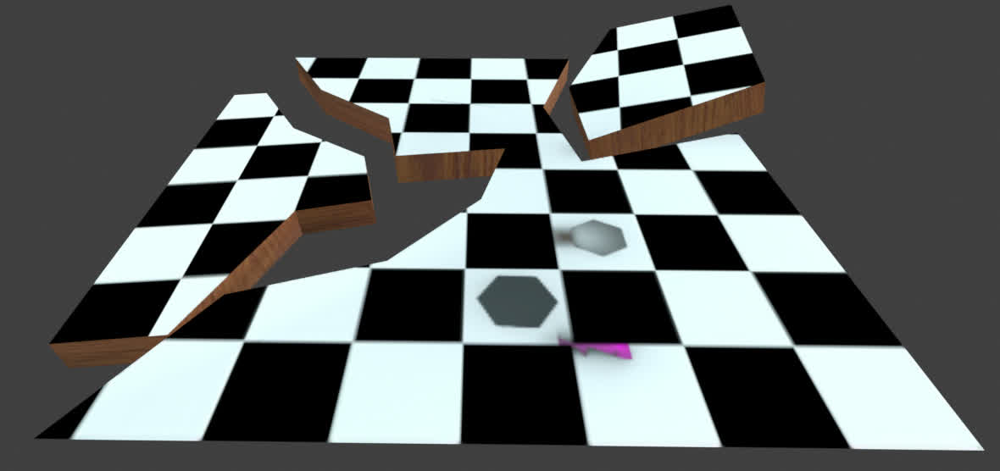

Here is a bake for 1024x1024 image.

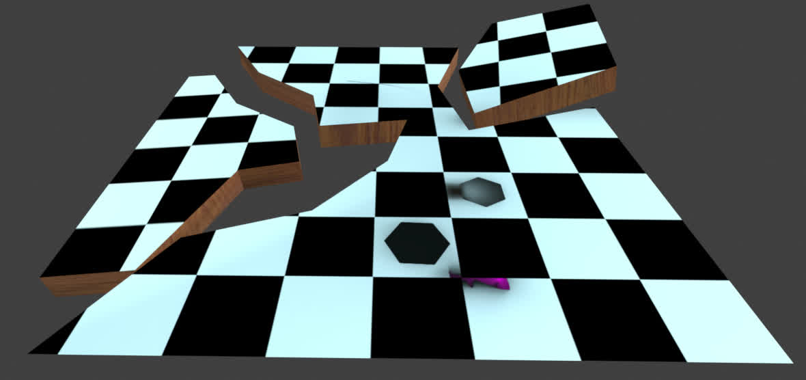

Here is the comparison. Just ignore shading. I just forgot to put on lighting.

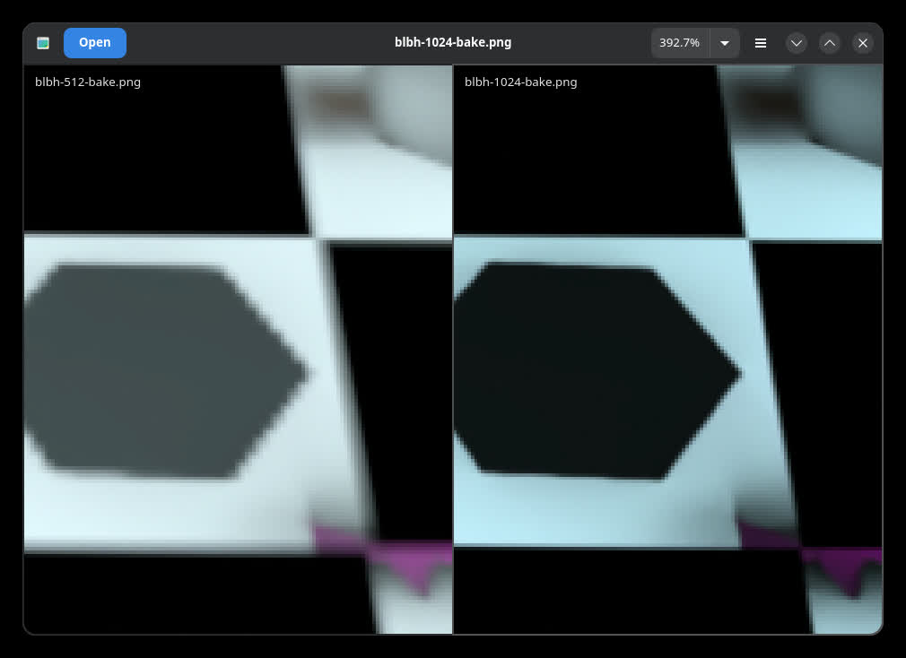

There is no texture blending or repeating. What you see in the atlas is what you get. So yes, the higher resolution of the atlas, the more detailed the model is.

The solution is to bake higher resolution texture.

### Problem #4 -- Vanilla GoldSrc max texture size is 512x512

This is simple, just split the textures into smaller pieces where the biggest size should be 512x512.

### Problem #5 -- Oh wow, that is so simple. I just split the texture and.... WTF, it does not make sense because the model is baked in an atlas, geometry would not be able to link to split textures

Yes, this is what BLBH does. It turns an atlas into smaller texture images and retain (precisely, *transform*) original geometry data.

## The problem that BLBH solves

If you still don't see the problem, consider this geometry and atlas.

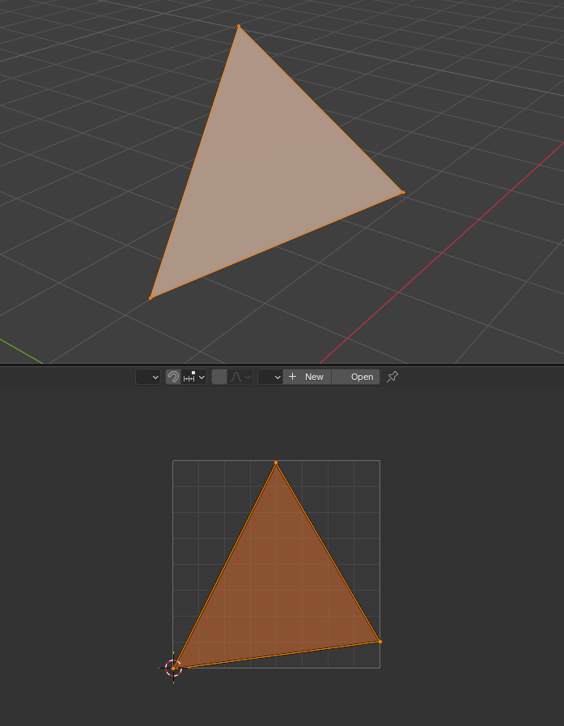

The atlas texture size should be 1024x1024. So, according to studio model max texture size, the image is split into 4 512x512s.

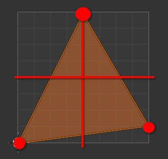

Now, one triangle spans across 4 textures. A triangle should have only 1 material, not 4 of them. What to do next is to split this triangles down so that each partition can have its own material.

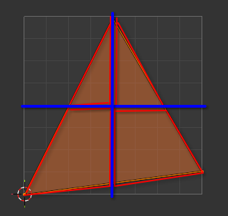

The original triangle is broken down to 4 polygons. These 4 polygons are contained in each texture tile. Finally, the geometry is conformant and so original atlas becomes usable regardless of its resolution.

## The rest of BLBH implementation

The program must be able to translate a face split in 2D UV to 3D world. This is math.

Choose 1 point as an "anchor point".

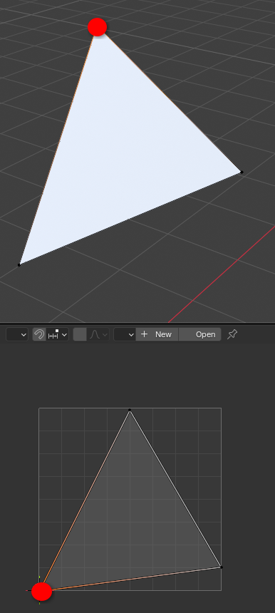

Form two vectors from anchor.

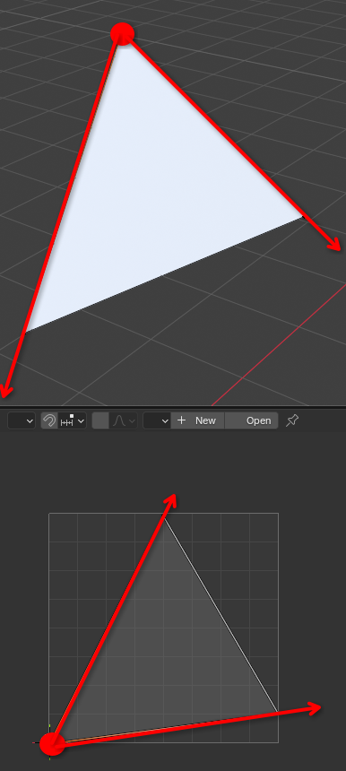

What we have now are 2 bases, one is in 2D and another is in 3D. If a point A is X unit away from the anchor in 2D, we take that difference between that point A and 2 vectors as a ratio, take that number and apply to 3D vectors, then we have the coordinate in 3D from 2D. This fancy math is just solving a system of equations, or a matrix.

```rust
let anchor_vertex = &tri.vertices[0];
let anchor_vector_uv0 = tri.vertices[1].uv - anchor_vertex.uv;
let anchor_vector_uv1 = tri.vertices[2].uv - anchor_vertex.uv;
let anchor_vector_pos0 = tri.vertices[1].pos - anchor_vertex.pos;
let anchor_vector_pos1 = tri.vertices[2].pos - anchor_vertex.pos;

let uv_mat = Matrix2x2::from([
    anchor_vector_uv0.x,
    anchor_vector_uv1.x,
    anchor_vector_uv0.y,
    anchor_vector_uv1.y,
]);

let uv_to_world = |uv: DVec2| {
    let target_vector_uv = uv - anchor_vertex.uv;

    let coefficients: [f64; 2] = uv_mat
        .solve_cramer([target_vector_uv.x, target_vector_uv.y]);

    (anchor_vector_pos0 * coefficients[0] + anchor_vector_pos1 * coefficients[1])
        + anchor_vertex.pos
};
```

Going from 3D to 2D is the exact same thing.

With this math, a cut in the 2D plane, which is either a vertical or horizontal line where the texture ends, should also affect actual 3D geometry.

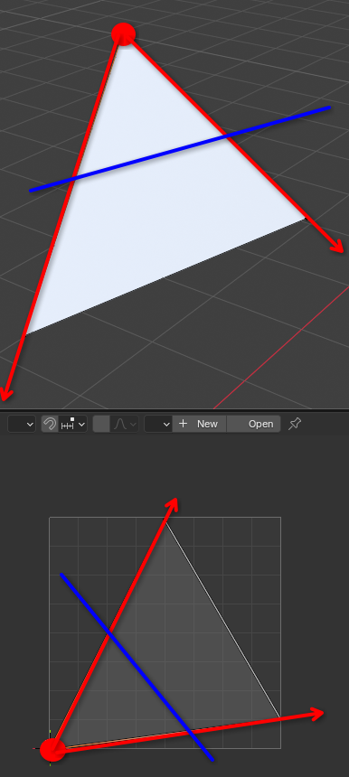

And that's it for BLBH core. Very simple high school math.

## Compiling a BLBH model

This technique is very scalable. It is possible to compile a model with atlas with any size. 4096x4096 is the biggest number that I can recommend because it also aligns with studio model max texture count.

4096x4096 = 8x8 512x512 images = 64 512x512 images. A studio model can only have maximum 64 textures. The model file size is ~16MB.

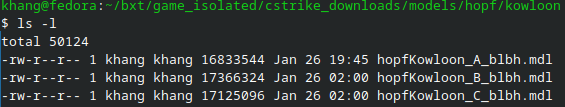

It is possible to go bigger yes, but let me first digress with a different problem.

I want BLBH to be as simple to use as possible. Since a user can just dump a huge texture size (4K), can they also dump a very big mesh? It is very nice if the program just works.

What is the problem with big mesh anyway you may ask? A studio model *mesh* (precisely *bodypart*) can only contain 2048 vertices. So, I have to split the big mesh file to smaller meshes where each has maximum 2048 *unique* vertices.

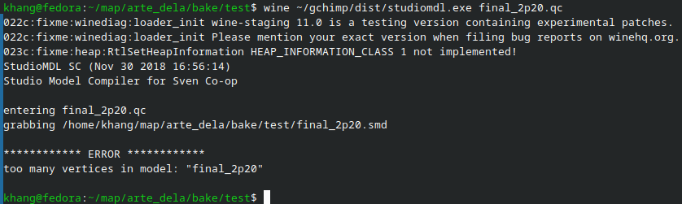

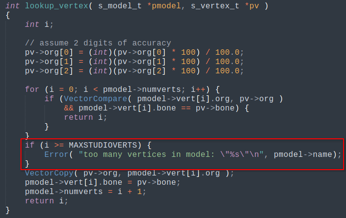

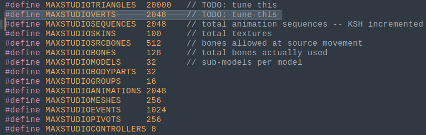

Luckily for me, I have solved it before for another project [gchimp Map2Mdl](https://github.com/khanghugo/gchimp/wiki/Map2Mdl). The solution just works very nicely for BLBH. The problem has nothing much to do with BLBH but more of studio model limit where it does not allow a model with too many vertices. It is a model compile problem. Just slap on a hash function for vertex and keep track of them in each mesh file and voila!

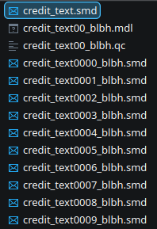

Now, at the end of a bake, I should have: one big atlas and one big mesh. Those two are the inputs to BLBH. Big texture is not limited to 4K. The work around is to use *more than one* models for compiling. I use that technique for [gchimp SkyMod](https://github.com/khanghugo/gchimp/wiki/SkyMod) and that allows 2K skybox (16 * 6 = 96 textures).

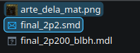

## Seeing the models in-game

The model should just work, right? Not quite.

Consider this handsomely lit cube.

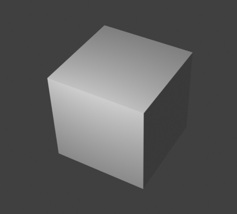

Without any tricks, this is what it looks in-game.

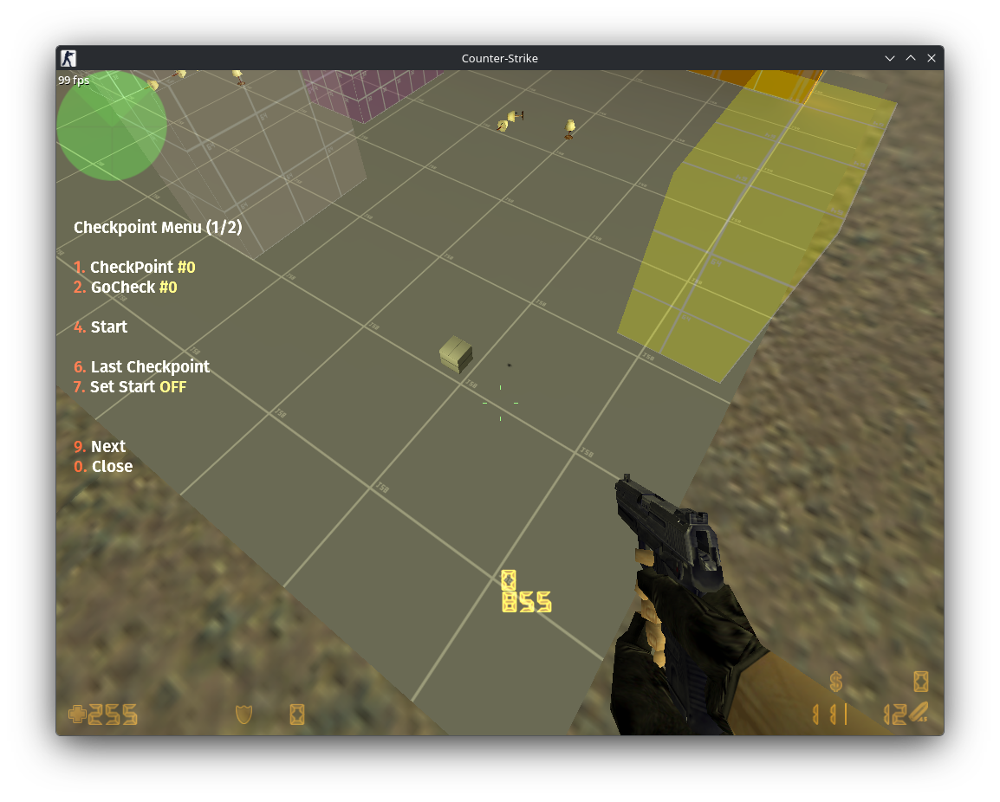

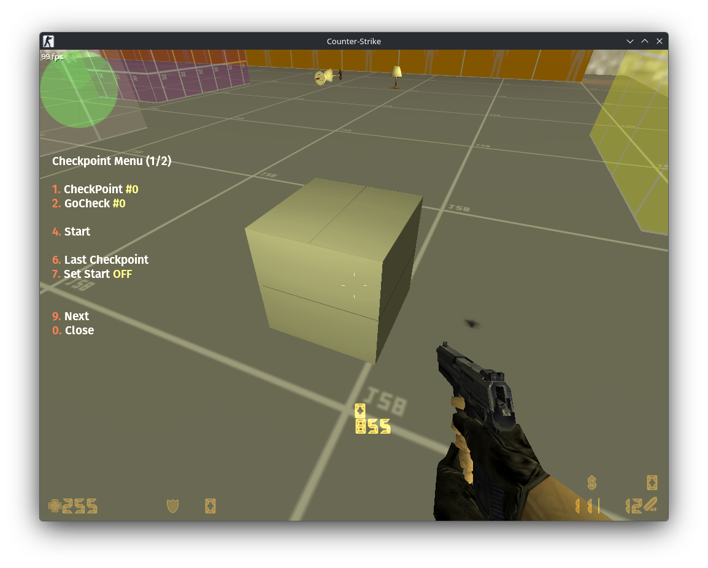

No matter how far or close I am to the model, there are distracting visible seams.



Luckily for me, again, I encountered this problem before and had solved it while working on SkyMod.

The cause is edge bleeding. If the UV coordinate is exactly at 0.0 or 1.0 and there is not enough edge padding from texture side, mipmapping samples point beyond the edges, resulting in different colors.

The solution is to min-max the UV at least one pixel away from the edge.

UV without offset

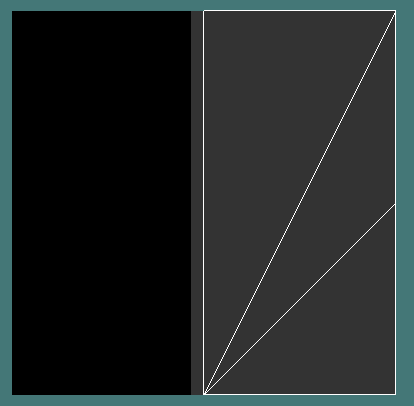

UV with offset

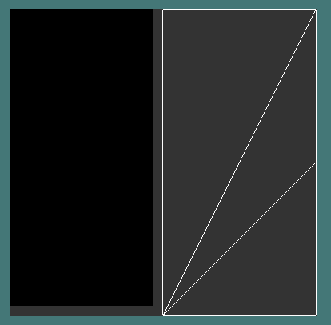

Uv with offset, closer look

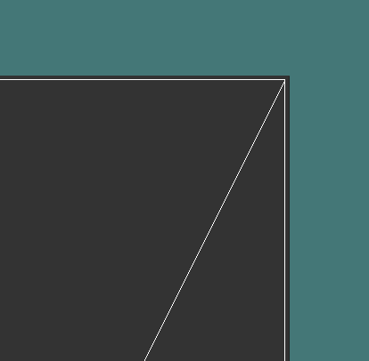

In motion



This is only 1px UV fix and the rendering resolution is very low. User can freely change this number in BLBH panel. They can also fix the texture itself of course by adding more padding.

And that's it, a model with baked lighting in GoldSrc.

## More than just baking light

To reiterate what BLBH does

> BLBH stands for "Blender lightmap baker helper". What it actually does is to split any* arbitrary atlas image to smaller textures of size 512x512.

The usage is not limited to just compiling *light baked* models, it is to compile *any baked* models.

In arte_drift, I use it for the tree roots and the lines.

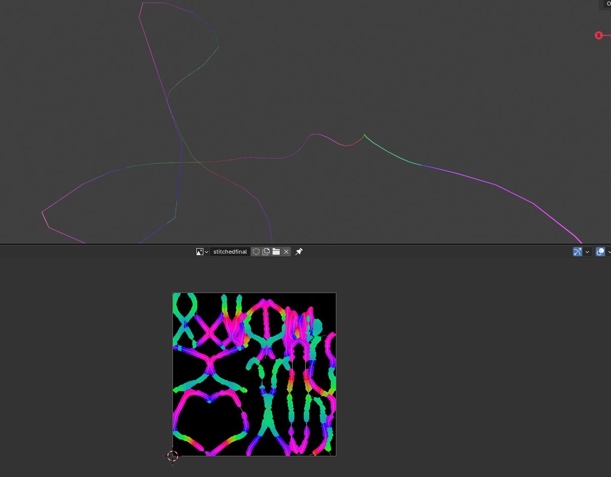

Some people on TWHL did funny stuffs with it.

Horse statue by Lockdown (chalkdown)



I use BLBH for making terrain in [vLy_nantu2_d](https://www.youtube.com/watch?v=P3waa375lbw). An upcoming map by [chorykapitan](https://kreedz.com/profile/chorykapitan) also uses BLBH for terrain. The images here look terrible because HLAM on Linux has very weird shader.

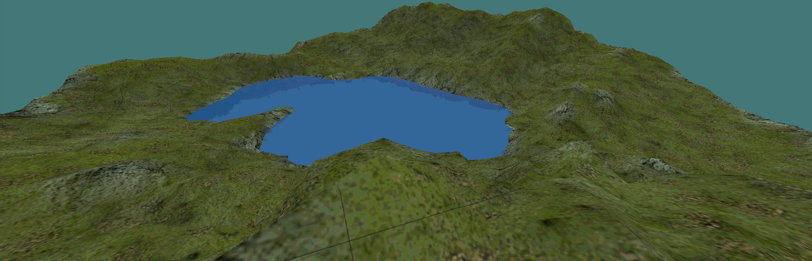

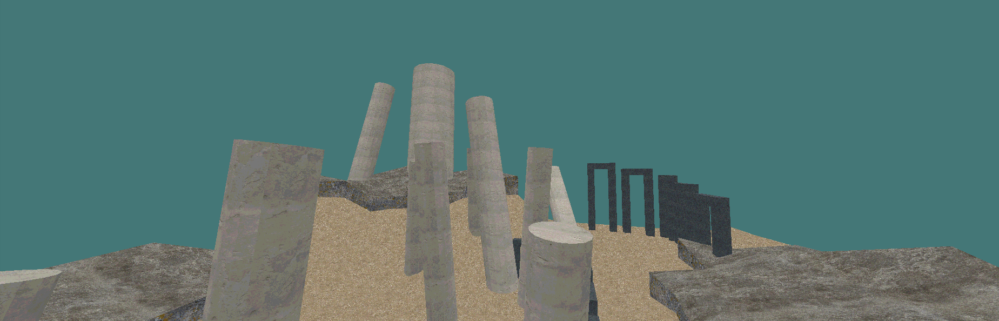

## Wrapping up

I made a video on how to use BLBH and bake model. Now I watch it again it is kind of bad because I did not prepare a script or anything. But it should let you know how I use it.



I have no ideas what to do next for gchimp. Maybe I can do light compiler, who knows.
